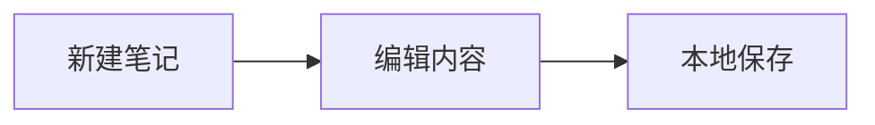

# 综合内容样本

中文正文 English 123，**重点**、*斜体*、~~已废弃~~、`inline code`、==高亮文字==。

## 任务与引用

- [ ] 验证图片
- [x] 验证表格
- 父任务
  - 子任务 A
  - 子任务 B

> 普通引用：记录一段有用的说明。

> [!NOTE] 提示
> 这是一条 Obsidian 提示块。

## 数值表格

| 项目 | 金额 | 完成率 | 备注 |
| :--- | ---: | ---: | :--- |
| 编辑器 | 12345.67 | 99.5% | 中英文 mixed content |
| 图片 | -120.00 | 0% | 这是较长的中文说明，用来观察窄屏换行 |

## 代码、公式与图示

```typescript
const message: string = "记录你的想法";
console.log(message);
```

行内公式 $E=mc^2$。

$$
\sum_{i=1}^{n} i = \frac{n(n+1)}{2}
$$



## 链接与附件

[站点链接](https://example.com) · [[编辑体验审计 2026-09-06（测试）]]


脚注测试[^1]。

[^1]: 这是一条脚注解释。

---

最后一段：在这里继续写作。
